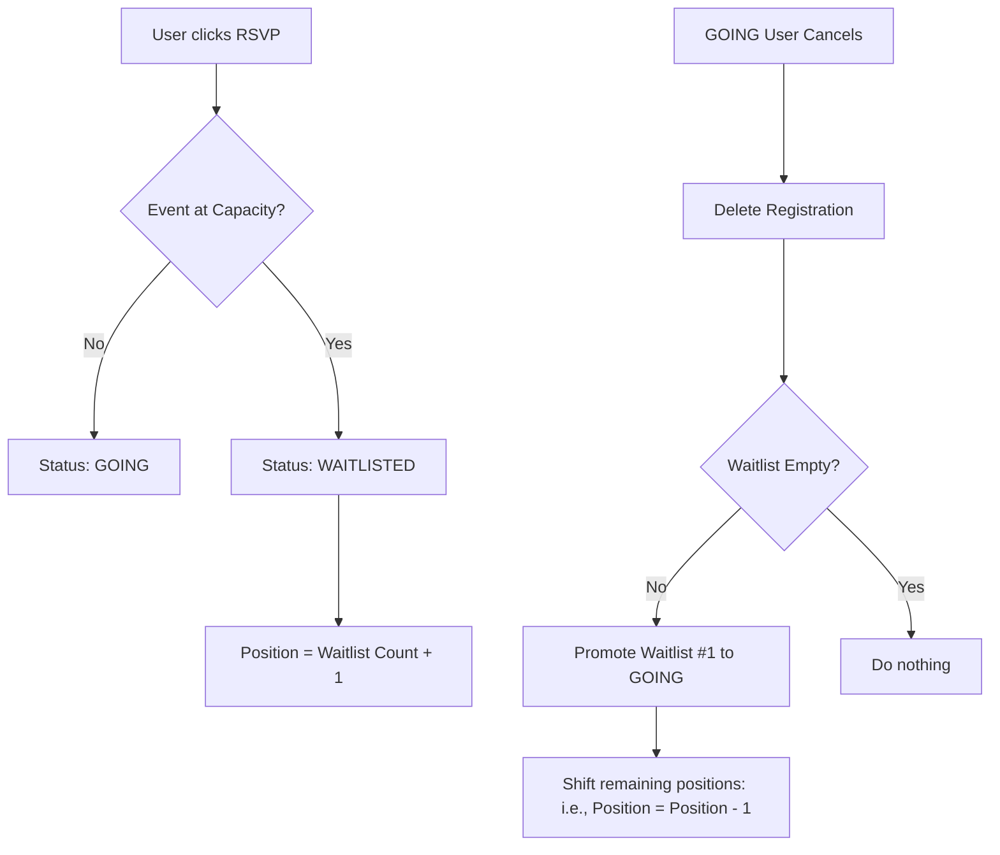

# Event Discovery & Collaboration Platform (Assessment Submission)

A premium, minimal event discovery mobile application built using **React Native + Expo + TypeScript**, featuring high-fidelity dark liquid-glass aesthetics, real-time RSVP capacity state transitions, waitlist queues, auto-promotions, and collaborative "Plan Together" invitations.

---

## 🚀 Quick Start & Run Scripts

Follow these steps to clone, install, and run the project locally:

### 1. Clone the Repository & Install Dependencies
```bash
# Clone the repository
git clone https://github.com/itsalam149/event-discovery-platform.git

# Navigate into the project folder
cd event-discovery-platform

# Install dependencies
npm install
```

### 2. Launch the Metro Bundler
Start the development server with a clean cache to initialize native assets:
```bash
npx expo start -c
```

### 3. Open the App in Expo Go
- **Physical Device (Recommended)**: Install the **Expo Go** app from the App Store (iOS) or Google Play Store (Android) and scan the QR code displayed in your terminal.
- **iOS / Android Emulator**: Press `i` to boot the iOS Simulator, or `a` to open the Android Emulator (make sure your emulator is running).
- **Web Browser**: Press `w` to open a preview in your web browser.

---

## 🎨 System Design & Architecture

The platform is designed around a decoupled architecture to separate view presentation layers from data structures and business mutation logic.

```
/
├── App.tsx               # Root App entry, safe area provider, and navigation shell
└── src/
    ├── types/
    │   └── index.ts      # TypeScript interfaces (User, Event, Invite, NavigationState)
    ├── services/
    │   └── mockApi.ts    # Seeded database state & latency network simulator (API simulator)
    ├── context/
    │   └── AppContext.tsx # React Context managing global state, optimistic UI, and routing
    ├── screens/
    │   ├── FeedScreen.tsx      # Discovery Feed with category filtering & text search
    │   ├── EventDetailScreen.tsx # Event Details, attendee avatars list, and RSVP actions
    │   ├── AttendeeListScreen.tsx # Attendees checklist and collaborative group planner
    │   └── InboxScreen.tsx     # Inbox Segmented views for pending and past plan invites
    └── components/
        ├── EventCard.tsx       # Discovery feed card displaying spots count and progress
        ├── AttendeeRow.tsx     # Reusable attendee row with checkbox state
        ├── InboxInviteCard.tsx # Inbox list item with Accept/Reject buttons
        ├── Toast.tsx           # Floating glassmorphic notifications (Success, Error, Info)
        ├── UserSelector.tsx    # Header control panel for switcher profiles & error injector
        └── ShimmerLoader.tsx   # Glassmorphic skeleton loader for simulated load latency
```

### 1. Stateless Service Layer (`mockApi.ts`)
Operating like a real backend server, this layer holds an in-memory representation of our data (users, events, RSVPs, invites). Every endpoint returns standard, type-safe API responses with a simulated latency of **300ms to 1500ms** to test realistic async user experiences:
```typescript
export interface ApiResponse<T> {
  data: T | null;
  error: string | null;
}
```

### 2. Active User Switcher (Demo Panel)
To test collaborative flows (such as sending an invite from Bob to Alice and observing it in Alice's inbox), I implemented a **Global User Switcher** in the header. Reviewers can instantly toggle between Alice, Bob, Charlie, and Diana to test multi-user state synchronization.

### 3. Navigation State Engine (`AppContext.tsx`)
Rather than pulling in heavy external routers, I built a lightweight, robust navigation stack inside global React Context. The routing stack stores the navigation path history as an array of screen names and params:
```typescript
export interface NavigationState {
  currentScreen: ScreenName;
  params?: RouteParams;
  history: Array<{ screen: ScreenName; params?: RouteParams }>;
}
```
This is fully integrated with Android hardware buttons (using React Native's `BackHandler`), letting users natively step backward through screens (`AttendeeList` $\to$ `EventDetail` $\to$ `Feed`) without unexpected application exits.

---

## ⚡ State Transitions: Waitlists & Auto-Promotions

The platform handles capacity-based transitions through sequential queue operations in the service layer:



- **Waitlist Allocation**: If an event has a capacity of $C$ and currently has $C$ participants, the next RSVP is marked as `waitlisted` and assigned position $W + 1$ (where $W$ is the current waitlist size).
- **Auto-Promotion**: When a user marked as `going` cancels their RSVP, the server queries the waitlist, promotes the attendee at Position `1` to `going`, and shifts all remaining waitlisted positions up ($P \to P-1$).
- **Real-Time Celebrations**: If the active user gets promoted while another user cancels their RSVP, the app detects this on refetch and fires a congratulatory toast: `🎉 You've been promoted to GOING for "Event Title"!`.

---

## 🔄 Transaction Strategy: Optimistic vs. Pessimistic Mutations

I chose specific transaction patterns for each button press based on user experience needs:

| Action | Strategy | Rationale | Rollback / Error Handling |
| :--- | :--- | :--- | :--- |
| **RSVP / Revoke** | **Optimistic** | RSVPs are high-frequency taps. Waiting for a server response makes the button feel unresponsive. The UI toggles state instantly. | Caches the previous event list (`previousEvents`). If the API returns an error, it rolls back the state and displays an error toast. |
| **Invite Responses** | **Optimistic** | Accepting/declining plan invites should feel snappy. The card updates immediately, blocking double-taps. | Caches the previous invites list. Reverts to previous values on API failure. |
| **Send Group Invites** | **Pessimistic** | Creating a plan group requires validation (e.g. no double invites). The screen displays a spinner on the button until the server confirms success, then pops the screen. | In case of failure, the list remains open and an error toast is shown so the user can modify selections and retry. |

---

## 💎 Frosted Glassmorphism & Mobile UX Polish

To elevate the application's look to feel like a premium, modern mobile app (reminiscent of iOS liquid-glass visual styles), I integrated several design details:

1. **Layered Neon Glow Backdrops**:
   - Designed a deep, dark void layout utilizing a subtle gradient (`#090D1A`, `#111827`) layered underneath three neon glowing blur blobs (Top-Left Indigo, Mid-Right Rose, and Bottom-Left Emerald).
2. **Glassmorphic Components**:
   - Content cards, input boxes, search bars, and the header profile badges use semi-transparent backing fills (`rgba(30, 41, 59, 0.45)`) and fine borders (`rgba(255, 255, 255, 0.08)`) with a high drop shadow radius.
3. **Frosted Bottom Nav & Sticky Footers**:
   - Replaced solid backgrounds on absolute-positioned sticky elements (the bottom tab navigation, details screen footer, and attendee list CTA panels) with frosted `BlurView` wrappers. Content and cards scroll underneath with realistic blur depth.
4. **Android Native Stability**:
   - Configured stable native packages (`react-native-safe-area-context` and `expo-font` unified at `14.0.11`) to prevent layout freezes.
   - Refactored `BackHandler` using mutable refs to keep the Android hardware back press listener responsive to route history state updates.

---

## 🤖 AI Collaboration & Engineering Process

During this assessment, I partnered with **Antigravity (Google DeepMind)** in a collaborative pair-programming model:

1. **Strategic Planning**:
   - Before writing any code, I aligned on a technical approach in `implementation_plan.md`. This detailed how state, navigation, and API simulations would operate.
2. **Incremental Execution**:
   - First established types and the mock service layer, then built the UI layout and navigation engine, and finally layered screens and screens interactions.
3. **Diagnostics & Native Rectifications**:
   - When Expo Go encountered native library conflicts, I ran `expo-doctor` to pinpoint the mismatched native module `expo-font` version (`55.0.8` vs `14.0.11`) and fixed it via Expo CLI.
   - Swapped the deprecated `SafeAreaView` from React Native core with the modern `SafeAreaProvider` + `SafeAreaView` from `react-native-safe-area-context` to resolve rendering warnings and ensure compatibility.
4. **Visual Iterations**:
   - Polished HSL color schemes, opacity fills, and layouts step-by-step to create the premium glassmorphic UI.
5. **Robust Error Simulation**:
   - To make it easy to test pessimistic rollback states, I added a **"Simulate API Network Failure"** switch in the Demo Control Panel, letting reviewers intentionally trigger and observe optimistic state rollbacks.
# event-discovery-platform
